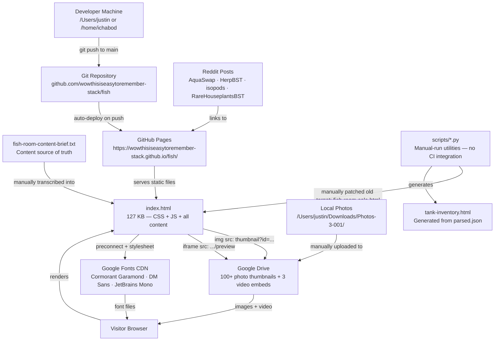

# Architecture Review: fish-room-downsizing-sale

**Review Date:** 2026-05-01
**Scope:** Full repository audit — `/home/user/fish`
**Purpose:** Equip a developer to understand, critique, and propose improvements to this system.

---

### Complete claude.md Context

> The following is the complete contents of `CLAUDE.md` as of 2026-05-01. This is the baseline knowledge all contributors share. All subsequent analysis in this document references and builds upon it.

---

# CLAUDE.md

**Last Updated:** 2026-04-29 UTC

This file provides guidance to Claude Code (claude.ai/code) when working with code in this repository.

---

## What This Is

A single-file static site for a fish room downsizing sale — fish, amphibians, plants, and equipment. No build step, no framework, no dependencies. The entire site is one self-contained HTML file (`index.html`) with inline CSS and JS.

**Live URL:** <https://wowthisiseasytoremember-stack.github.io/fish/>

The site is deployed via GitHub Pages directly from the `main` branch root. There is no build step and no server-side rendering.

---

## File Structure

| File / Folder | Purpose |
| :--- | :--- |
| `index.html` | The site. Everything lives here — CSS, JS, and all content. (Renamed from `fish-room-sale.html` for GitHub Pages.) |
| `fish-room-content-brief.txt` | Source of truth for species inventory, quantities, care notes, and pricing policy. Update here first; HTML reflects it. |
| `Tank Inventory.md` | Physical tank layout and current contents. Cross-check species availability against this. |
| `tank_tasks/` | ~123 per-tank Markdown task files. Reference only — not rendered on the site. |
| `scripts/` | Python utility scripts for HTML generation, enrichment, minification, and sanitization. Not part of the site — run manually when needed. |
| `listings/` | Platform-specific Reddit post drafts (r/aquaswap, r/plantswap, r/hardwareswap, etc.) |
| `queue/drafts/` | Active posting drafts. `READY-TO-POST.md` lists what's ready to go. |
| `PHOTO_CATALOG.md` | Catalog of ~90 photos in local `Photos-3-001/` folder (not committed). Maps photos to subreddits and posting order. |
| `sales-listings.md` | Consolidated human-readable inventory with pricing and care notes. |
| `HANDOFF.md` | Session-to-session context for ongoing work. Update at end of every session. |
| `CHANGELOG.md` | Append-only record of all significant changes. Update when committing meaningful work. |
| `.github/workflows/markdown-lint.yml` | CI: runs `markdownlint-cli2` on all `*.md` files on push/PR to `main`. |
| `.markdownlint.json` | Markdownlint rule config (MD013 line-length disabled). |
| `.autoresearch/config.yaml` | Config for autoresearch agent (time budget, scope). Not site-related. |
| `tank-inventory.html` | Secondary HTML page (55 KB) generated by `scripts/generate_html.py` from `parsed.json`; shows rack/shelf/tank hierarchy with bioluminescent bubble animation. Different color palette and fonts from `index.html`. |
| `tank_inventory/` | 41 committed JPEG photos of tank inventory + `scripts/download.py` (Google Photos scraper) + `INVENTORY_HANDOFF.md`. Photos are committed here (unlike the sale site's Drive-hosted photos). |
| `TODO.md` | Pending task tracker — includes unresolved placeholders (VIDEO_ID_1/2, Venmo handle, Abigail photo), Dragon Puffer photo blocker, and cross-browser testing items. |
| `fish-room-floor-plan.png` | Room floor plan image (455 KB). Not linked from the live site; reference asset only. |
| `reddit-post.md` | Legacy early Reddit draft, superseded by `queue/drafts/aquaswap-main-post.md`. Kept for history. |

---

## Branches

- `main` — stable, deployed to GitHub Pages. All content changes land here.
- Feature branches follow the pattern `claude/<description>-<id>` and are merged via PR.

---

## HTML Architecture

`index.html` (3,246 lines) is structured top-to-bottom as:

1. **CSS custom properties** — color palette and font stack
   - Category colors: `--color-fish` (#00b4d8), `--color-herp` (#f4a261), `--color-invert` (#b07aff), `--color-plant` (#2dc653), `--color-fungi` (#e07cff)
   - Status colors: `--color-empty` (#3a3f4a), `--color-storage` (#2a2e38)
   - Fonts: Cormorant Garamond (headings), DM Sans (body), JetBrains Mono (accents) — loaded from Google Fonts
2. **Animated canvas background** — `#bg-canvas` fixed full-screen canvas with particle/bubble animation. Keep it lightweight.
3. **Hero section** — title, subtitle, last-updated timestamp. Update the timestamp when publishing content changes.
4. **Stats bar** — animated counters for years, species count, etc.
5. **Racks/tank overview section** — physical room layout
6. **Species search** — `#species-search` input filters across all compendium panels in real time
7. **Media panels** — side-by-side photo carousel (`#main-carousel`) and video player (`#video-main`), each with an expand-to-modal button. Photos load from Google Drive thumbnail URLs. Videos are Google Drive embeds.
8. **Media modal** — `#media-modal` full-screen overlay; DOM nodes are moved in/out (not cloned) to preserve carousel/video state.
9. **Compendium** — tabbed species browser with animated slide transitions between panels:
   - Rail nav (`.rail-item`) for Fish / Herps / Inverts / Plants
   - Four panels: `#fish-list`, `#herp-list`, `#invert-list`, `#plant-list`
   - `switchCategory()` handles directional CSS transitions (`translateX`)
10. **Equipment section** — hardcoded HTML cards grouped by type (tanks, filtration, lighting, hardscape)
11. **Footer** — three-column grid: contact form, Abigail Breslin memorial, freelance pitch

**No data layer.** All species content is hardcoded HTML. To add or update an animal, edit its card in `index.html` and keep `fish-room-content-brief.txt` in sync.

---

## Photo / Video Assets

Photos and videos are **not committed to git** — they live locally at `/Users/justin/Downloads/Photos-3-001/` and are served via Google Drive share links. The site uses:

```text
https://drive.google.com/thumbnail?id=<FILE_ID>&sz=w1000   ← static images
https://drive.google.com/file/d/<FILE_ID>/preview           ← video embeds
```

`PHOTO_CATALOG.md` maps each filename to its Google Drive ID and target subreddit. Update it when new photos are added.

---

## Python Scripts (`scripts/`)

These are standalone utilities — none are called by the site or CI:

| Script | What it does |
| :--- | :--- |
| `generate_html.py` | Generates species card HTML from a JSON data file |
| `enrich_html.py` | Enriches HTML cards with data from `task_data.json` |
| `inject_verified_data.py` | Injects verified scientific names / care data into HTML |
| `sanitize_sale_site.py` | Strips internal location strings and prevents content bleed |
| `update_html.py` | General HTML patching utility |
| `consolidate_json.py` | Merges multiple task JSON files into one |
| `clean_enrichment.py` | Removes stale enrichment artifacts |
| `minify_css.py` / `minify_js.py` | CSS/JS minification helpers |
| `fix_engagement_visibility.py` | Moves inline `<style>` block from `<head>` to just before `</body>` for paint performance testing |
| `xray_report.py` | Generates a diagnostic report of site content |
| `generate_listings.py` (root) | Scrapes `tank_tasks/*.md` for inventory entries and pricing to build `sales-listings.md` |

---

## CI

GitHub Actions runs on every push/PR to `main`:

```text
.github/workflows/markdown-lint.yml
```

Uses `markdownlint-cli2-action@v16`. All `*.md` files must pass. Rules are in `.markdownlint.json` (MD013 disabled). Fix lint errors before pushing — the `tank_tasks/` directory is included.

---

## Content Source of Truth

`fish-room-content-brief.txt` is the canonical species list and pricing policy. Before editing card content in `index.html`, check this file. If the brief and the HTML disagree, the brief is correct.

- Quantities marked "TBD" → display as "Inquire" in HTML. Never invent a number.
- Local pickup preferred (LA/Orange County). Shipping is last resort.
- No location info displayed publicly on the site.
- Native herps (Taricha, CA tree frogs): always include chytrid fungus release warning.

---

## Previewing Changes

Open `index.html` directly in a browser — no server needed.

```bash
open index.html          # macOS — opens in default browser
```

---

## Testing Changes

Always verify after edits:

1. Category rail (Fish, Herps, Inverts, Plants) — click all four, confirm animated slide transitions work
2. Species search — type a term, confirm cards filter correctly across active panel
3. Photo carousel — prev/next and dots, auto-advance, expand modal
4. Video carousel — prev/next, caption text, counter
5. Equipment section — scrolls and renders
6. Mobile layout — resize or DevTools; media panels stack single-column, footer cards stack vertically
7. Canvas background animation still runs
8. No console errors

---

## Common Edits

**Update a species quantity:** Edit the card in `index.html` (find by species name) AND update `fish-room-content-brief.txt`.

**Add a photo to the carousel:** Add a `{id: '<DRIVE_FILE_ID>', alt: '...'}` entry to the `photos` array near line 3011 in `index.html`. Photos load via the Google Drive thumbnail URL pattern.

**Update the hero timestamp:** Change the `<p class="hero-timestamp">` value in the hero section (~line 1349).

**Add a Reddit post draft:** Create a new `.md` file in `listings/` or `queue/drafts/`. Update `queue/drafts/READY-TO-POST.md` with posting order. Run markdownlint locally before committing.

---

## Architectural Audit Notes (2026-05-01)

- **`tank_tasks/` is absent from the repo.** CLAUDE.md, `generate_listings.py`, and `update_html.py` all reference it, but the directory does not exist in the current checkout. Scripts depending on it will fail.
- **All scripts in `scripts/` reference the old filename `fish-room-sale.html`**, not the current `index.html`. Every enrichment/minification script must have its target path corrected before use.
- **Script paths are machine-specific and non-portable.** `update_html.py` hardcodes `/Users/justin/`, `generate_listings.py` and `download.py` hardcode `/home/ichabod/`. These are two different machines — scripts cannot be run without editing paths first.
- **`consolidate_json.py` is a non-functional stub** — its body contains only `pass`.
- **`tank_inventory/scripts/download.py`** scrapes Google Photos (not Google Drive) via `https://photos.app.goo.gl/...` — a distinct external service not mentioned elsewhere in docs.
- **Only one stat counter is animated** (`#stat-years`, target=9 via IntersectionObserver). The other three stats (52+ Species, 40+ Tanks, ∞) are static text; the CLAUDE.md description of "animated counters" (plural) is imprecise.

---

*End of CLAUDE.md contents.*

---

### System Purpose & Goals

#### What CLAUDE.md already states

The repository is a static sale site for a fish room downsizing event. The seller (based in LA/Orange County) is liquidating fish, amphibians, plants, and aquarium equipment via GitHub Pages, with Reddit and Facebook as discovery channels.

#### What deep analysis reveals

**1. The site is a dual-purpose asset.** It serves as both a sale listing AND a technical portfolio. The footer's third column contains a freelance software development pitch (lines 2,596–2,600 of `index.html`). The site's technical sophistication — animated canvas, modal system, carousel — is intentionally excessive for a classified ad, serving as a live demonstration of frontend skill.

**2. The downsizing is crisis-driven.** The driving event is the death of the owner's cat, Abigail Breslin (2012–2026), and associated ~$4,000 in veterinary bills. Every Reddit post draft (`aquaswap-main-post.md`, `herpbst-post.md`, etc.) leads with this narrative. The site's memorial section and donation links (Venmo `@jakeynguyen16`, Ko-fi `thetangletrove`) are emotionally integrated into the sale flow — a deliberate design decision to build buyer trust and enable charitable contribution.

**3. The inventory is diverse and multi-hobby.** The sale spans four distinct hobby communities:
- **Aquarium:** 16 fish species, aquatic inverts, aquatic plants, filtration/tank hardware
- **Herpetology:** 6 amphibian/reptile species (some native CA — legally sensitive)
- **Houseplants:** 15+ collector-grade tropical aroids (Monstera Albo, Thai Constellation)
- **Technology:** Laptops, vintage Mac software, aviation training materials

The tech/vintage items indicate the fish room is not the only thing being liquidated — this is a broader life reorganization.

**4. Multi-channel content publishing is a core workflow.** The repo contains 13 platform-specific post drafts across 7+ subreddits and multiple Facebook groups, with a coordinated cross-linking strategy. This content workflow is as important as the site itself.

**5. Legal and ethical compliance is embedded in content.** Multiple posts include explicit compliance language: CA Marmorkrebs prohibition (named as `Procambarus sp.`), native species chytrid risk warnings (Taricha newts, CA tree frogs), USDA interstate shipping requirements for arthropods, and tetrodotoxin liability disclosure. This is business logic encoded in Markdown, not enforced by any system.

---

### High-Level Architecture

**Classification:** Static monolith + disconnected utility scripts + manual content workflow

There is no server, no build pipeline, no database, no API, and no runtime. The entire "application" is a single HTML file served by GitHub Pages.



**Deployment topology:**
- Push to `main` → GitHub Pages serves from repo root
- No build step: `index.html` is the artifact
- No CDN (GitHub Pages is the CDN)
- No secrets or env vars required

**Secondary HTML page:**
`tank-inventory.html` is a 55 KB companion page generated by `scripts/generate_html.py` from `parsed.json`. It shows the physical rack/shelf/tank hierarchy. It is NOT linked from `index.html` and NOT served as a route — it exists as a local reference and is committed to the repo, but its generator script (`generate_html.py`) requires a `parsed.json` file that is not committed.

---

### Module Map & Core Dependencies

| Component | Path | Purpose | Key Internal Deps | External Deps | Why |
|---|---|---|---|---|---|
| Sale site | `index.html` | Entire public-facing site (CSS + JS + content) | `fish-room-content-brief.txt` (conceptual) | Google Fonts, Google Drive | No build step; zero-dependency deployment |
| Content brief | `fish-room-content-brief.txt` | Canonical species/pricing source of truth | None | None | Human-readable, editor-friendly source |
| Tank inventory | `Tank Inventory.md` | Physical room layout cross-reference | None | None | Tracks what's physically present vs. sold |
| Inventory page | `tank-inventory.html` | Generated rack/shelf/tank viewer | `parsed.json` (not in repo) | Space Grotesk font | Internal reference; not public |
| Listing generator | `generate_listings.py` | Builds `sales-listings.md` from task files | `tank_tasks/*.md` (missing) | None | Automates catalog from granular task files |
| HTML enrichment | `scripts/enrich_html.py` | Injects scientific names + care notes | `task_data.json` (not in repo), `bs4` | `lxml` parser | Batch-updates species cards without manual editing |
| HTML updater | `scripts/update_html.py` | Advanced: parses MD tasks → patches HTML | `tank_tasks/` (missing), `bs4` | `lxml` parser | Creates new species entries from task files |
| Data injector | `scripts/inject_verified_data.py` | Regex-injects verified JSON data into HTML | `verified_inventory.json` (not in repo) | None | One-shot data merge |
| Sanitizer | `scripts/sanitize_sale_site.py` | Removes location strings + cross-contaminated data | None | None | Prevents internal logistics data from leaking to buyers |
| HTML generator | `scripts/generate_html.py` | Generates `tank-inventory.html` from JSON | `parsed.json` (not in repo) | None | One-time build of inventory viewer |
| Minifiers | `scripts/minify_css.py`, `scripts/minify_js.py` | Inline CSS/JS minification | None | None | Manual pre-publication optimization |
| Photo downloader | `tank_inventory/scripts/download.py` | Scrapes Google Photos album → downloads JPEGs | None | `urllib`, Google Photos | Batch-acquires tank photos for inventory docs |
| CI | `.github/workflows/markdown-lint.yml` | Lints all `*.md` files on push/PR to `main` | None | `markdownlint-cli2-action@v16` | Content quality gate |
| Reddit drafts | `listings/`, `queue/drafts/` | Platform-specific post copy | `index.html` URL | Reddit, Facebook, MorphMarket | Multi-channel publishing workflow |
| Photo catalog | `PHOTO_CATALOG.md` | Maps local filenames → Drive IDs → subreddits | `HANDOFF.md` | Google Drive | Coordinates media between local storage and site |

**Notable absent files referenced by the codebase:**
- `tank_tasks/` — ~123 MD files; required by `generate_listings.py`, `update_html.py`, and the CI lint config
- `parsed.json` — required by `generate_html.py` to produce `tank-inventory.html`
- `task_data.json` — required by `enrich_html.py`
- `verified_inventory.json` — required by `inject_verified_data.py`
- `worktrees/` — referenced in `README.md` branches section; not present

---

### Critical Execution Flows

#### Flow 1: Page Load (Browser → Fully Rendered Site)

1. Browser requests `https://wowthisiseasytoremember-stack.github.io/fish/`
2. GitHub Pages serves `index.html` (127 KB, no compression configured)
3. Browser parses HTML; encounters `<link rel="preconnect" href="https://fonts.googleapis.com">` and `<link rel="preconnect" href="https://fonts.gstatic.com" crossorigin>` — parallel DNS/TCP preconnects begin
4. Browser encounters `<link rel="stylesheet" href="https://fonts.googleapis.com/css2?family=Cormorant+Garamond...">` — font CSS fetches; blocks render
5. Inline `<style>` block (lines 13–1,330) parsed — ~1,300 lines of CSS define the entire visual system
6. `<canvas id="bg-canvas">` rendered (lines 1,338)
7. HTML content sections parsed (hero, stats, racks, compendium, equipment, footer)
8. Inline `<script>` (lines 2,619–3,242) executes:
   - Canvas IIFE initializes: spawns 160 particles, 18 bubbles, 8 kelp, 5 rays; starts `requestAnimationFrame` loop
   - IntersectionObserver registered for `#stat-years` (line ~2,862)
   - `#species-search` keyup listener attached
   - Category rail click listeners attached; `activeCategory = 'fish'` set
   - Carousel: `photos` array (~100 items) iterated; `` + dot `<button>` elements created and injected into `#main-carousel`; `startTimer()` begins 4500ms interval
   - Video carousel: `videos` array (3 items) iterated; first video `iframe.src` set
   - Modal open/close listeners attached
9. Browser fetches Google Font files (woff2) as CSS resolves
10. Carousel images begin loading lazily from Google Drive (`drive.google.com/thumbnail?id=...&sz=w1000`)
11. First Drive image renders; `onerror` handler active to remove failed slides

**Latency risks:** Step 4 (font blocking), Step 10 (100+ Drive thumbnail fetches, sequential on scroll). No `loading="lazy"` appears to be set on dynamically-created carousel `` elements — all thumbnails begin loading immediately.

---

#### Flow 2: Category Switch (User Clicks Rail Nav)

Entry point: `index.html` line ~2,910 — click handler on `.rail-item`

1. User clicks a rail button (e.g., "Plants")
2. Click handler calls `switchCategory('plant')`
3. Guard: `if (isTransitioning || newCategory === activeCategory) return` — prevents overlapping animations
4. `isTransitioning = true` (mutex locked)
5. Direction computed: compare `categoryOrder.indexOf(newCategory)` vs `categoryOrder.indexOf(activeCategory)`; `categoryOrder = ['fish', 'herp', 'invert', 'plant']`
6. `newPanel` (e.g., `#plant-list`) positioned off-screen right (`translateX(100%)`) or left (`translateX(-100%)`) depending on direction
7. Container height locked to `oldPanel.offsetHeight + 'px'` to prevent layout shift during animation
8. Both `oldPanel` and `newPanel` set to `position: absolute`
9. `newPanel.offsetHeight` read — forces browser reflow to flush pending style changes
10. CSS transition (600ms, `cubic-bezier(0.25, 0.46, 0.45, 0.94)`) applied; `oldPanel` slides out, `newPanel` slides in
11. `transitionend` event (or 700ms fallback timeout) fires:
    - Inline styles stripped from both panels
    - `oldPanel.classList.remove('panel-active')`
    - `newPanel.classList.add('panel-active')`
    - Container height unlocked (`height: ''`)
    - `isTransitioning = false` (mutex released)
12. `applySearch()` called to re-apply any active search query to the newly visible panel

---

#### Flow 3: Photo Carousel Initialization and Navigation

Entry point: `index.html` line ~3,010 — IIFE runs on script parse

**Initialization:**
1. `photos` array (~100 `{id, alt}` objects) iterated
2. For each photo: `<div class="carousel-slide">` created; `` with `src="https://drive.google.com/thumbnail?id=${p.id}&sz=w1000"` injected
3. `onerror` handler on each ``: removes the slide from DOM, calls `rebuildDots()` to sync dot count
4. `<button>` dot elements created and appended to `.carousel-dots` container
5. `go(0)` called — `track.style.transform = 'translateX(0px)'`, first dot gets `.active` class
6. `startTimer()` — `setInterval(go(idx+1), 4500)` begins

**Navigation (`go(n)`):**
1. `idx = ((n % photos.length) + photos.length) % photos.length` — wraps modularly
2. `track.style.transform = 'translateX(-' + (idx * slideWidth) + 'px)'`
3. All dots' `.active` class cleared; dot at index `idx` gets `.active`
4. `clearInterval(timer); startTimer()` — resets auto-advance timer

**Expand to modal (see Flow 4).**

---

#### Flow 4: Media Modal Expand

Entry point: `index.html` line ~3,177 — click on `[data-expand="photos"]` or `[data-expand="videos"]`

1. User clicks expand button (⊞ icon) on carousel or video panel
2. Click handler reads `btn.dataset.expand` (`'photos'` or `'videos'`)
3. `origin` variable stores reference to the active media node (`#main-carousel` or `#video-main`)
4. `originParent` and `originNextSibling` saved — these are the restoration anchors
5. DOM node (NOT a clone) is reparented: `modalStage.appendChild(origin)`
6. `modal.classList.add('is-open')` → CSS transitions modal to full-screen
7. `document.body.classList.add('modal-open')` → `overflow: hidden` prevents background scroll
8. Carousel continues to function inside modal (same JS state, same DOM node)
9. **Close:** Backdrop click, `×` button, or Escape key triggers close:
   - `originParent.insertBefore(origin, originNextSibling)` — restores node to original position
   - `modal.classList.remove('is-open')`
   - `document.body.classList.remove('modal-open')`

**Risk:** If modal close is interrupted (e.g., `insertBefore` fails because `originParent` was modified during modal open), the carousel node is orphaned in `modalStage` and the original panel area goes empty. No error handling exists for this case.

---

#### Flow 5: Content Update Workflow (Developer Updating Inventory)

This is the primary human workflow for maintaining the site.

1. Check `fish-room-content-brief.txt` — update the canonical quantity/price/status there first
2. Open `index.html` in editor; find the species card by name (Ctrl+F)
3. Edit the relevant HTML directly — quantity badge, detail text, pricing span
4. If adding a new species: copy an existing `.species-entry` block and modify it; ensure `data-search` attribute covers all relevant search terms
5. Update the `<p class="hero-timestamp">` in the hero section (~line 1,349)
6. Open `index.html` in a browser; run through the 8-point testing checklist
7. `git add index.html fish-room-content-brief.txt`
8. `git commit -m "..."` → push to feature branch → PR → merge to `main`
9. GitHub Pages auto-deploys (no build step; changes live within ~60 seconds)

**There is no automated sync between `fish-room-content-brief.txt` and `index.html`.** Drift between the two files is detected only by human review.

---

### Developer Critique Context

#### 1. Google Drive as CDN — Single Point of Failure

All site media (100+ photos + 3 videos) is served from Google Drive via thumbnail URLs:
```
https://drive.google.com/thumbnail?id=<FILE_ID>&sz=w1000
```
Google Drive is not designed as a CDN. Known failure modes:
- **Quota exceeded:** Drive throttles thumbnail requests when files get too many views; returns a quota page instead of an image. The carousel's `onerror` handler removes failed slides silently — the entire carousel can drain to empty.
- **Authentication changes:** Google periodically requires files to be re-shared or re-published. ID rotation breaks all hardcoded references.
- **No cache headers:** Drive thumbnails may not be cached by the browser optimally.
- **No fallback:** There is no placeholder image, no retry logic, and no user-facing error state. Silent failure is the only behavior.

**Reviewer question:** Should the committed `tank_inventory/` JPEGs model be applied to sale photos? 41 photos are committed and served directly from GitHub Pages — this bypasses Drive entirely and is more reliable. The tradeoff is repo size (~455 KB for the floor plan alone; 41 tank photos at unknown compressed sizes).

---

#### 2. `tank_tasks/` — Missing Directory, Active References

The `tank_tasks/` directory does not exist in the current repo checkout, but it is referenced by:
- `CLAUDE.md` (file structure table)
- `generate_listings.py` (line 6: globs `tank_tasks/*.md`)
- `scripts/update_html.py` (line 6: reads all `.md` from `tasks_dir`)
- `.github/workflows/markdown-lint.yml` (lints `**/*.md` — would catch these files if present)
- `README.md` (listed in file structure)

These scripts silently produce empty output when run (no files found, no crash — just no listings generated). The CI lint check passes vacuously. Either the directory was never committed (kept local only), was deleted, or exists on a branch not yet merged.

**Reviewer question:** Are the ~123 task files intentionally excluded from the repo (too large/sensitive)? If so, `generate_listings.py` and `update_html.py` should document this prerequisite prominently.

---

#### 3. Script Ecosystem — Broken, Stale, and Non-Portable

All scripts are in a degraded state:

| Issue | Affected Scripts | Impact |
|---|---|---|
| **Target `fish-room-sale.html` (old name)** | `clean_enrichment.py`, `enrich_html.py`, `fix_engagement_visibility.py`, `minify_css.py`, `minify_js.py`, `sanitize_sale_site.py`, `update_html.py`, `xray_report.py` | All fail with FileNotFoundError on current repo |
| **Hardcoded `/Users/justin/` path** | `update_html.py` | Fails on any non-Justin machine |
| **Hardcoded `/home/ichabod/` path** | `generate_listings.py`, `download.py` | Fails on any non-ichabod machine |
| **Two different machine identities** | `update_html.py` vs `generate_listings.py` | Scripts were written/run on at least 2 different machines; no shared environment |
| **Depends on `task_tasks/`** | `generate_listings.py`, `update_html.py` | Produces empty output silently |
| **Depends on missing JSON files** | `enrich_html.py` (task_data.json), `generate_html.py` (parsed.json), `inject_verified_data.py` (verified_inventory.json) | Crash on run |
| **Non-functional stub** | `consolidate_json.py` | Does nothing (body: `pass`) |
| **Naive regex minification** | `minify_css.py`, `minify_js.py` | Can corrupt CSS/JS with comments inside strings or regex literals |

**None of the scripts can be run as-is on the current repo without modifications.** They represent a historical workflow artifact from a development phase using different machine configurations.

---

#### 4. Modal DOM Reparenting — Orphan Risk

The media modal (`index.html` lines 3,177–3,219) uses DOM reparenting instead of cloning to preserve carousel/video state. The save/restore pattern:

```javascript
originParent = origin.parentNode;
originNextSibling = origin.nextSibling;
modalStage.appendChild(origin);
// ... on close:
originParent.insertBefore(origin, originNextSibling);
```

This pattern is fragile in several ways:
- If another script modifies `originParent`'s children while the modal is open, `insertBefore(origin, originNextSibling)` may throw `HierarchyRequestError` or place the node incorrectly
- If the user opens the modal while a carousel animation is mid-transition, the transform state carries into the modal
- There is no `try/catch` around the restoration — a failure orphans the carousel node permanently until page reload

---

#### 5. Canvas Performance — No Scroll-Aware Pause

The canvas background (`index.html` lines 2,623–2,854) runs a `requestAnimationFrame` loop with 186+ moving objects (160 particles + 18 bubbles + 8 kelp + 5 rays + dynamic bioluminescent pulses). 

- **Tab visibility:** The loop correctly pauses on `visibilitychange` (hidden tab)
- **Reduced motion:** `prefers-reduced-motion` is respected (canvas hidden)
- **Scroll position:** The canvas is `position: fixed; z-index: 0` — it is always visible and always rendering, even when the user has scrolled to the equipment section at the bottom of a 3,246-line page

On a mid-range device with a large viewport, the canvas renders ~240 objects per frame at ~60fps with no pause mechanism tied to canvas visibility or scroll depth.

---

#### 6. Search Filter — Scope Limitation

The search implementation (`index.html` lines 2,891–2,908) operates only on the **active category panel**. Search state is not global:

```javascript
const entries = document.querySelectorAll('.compendium-panel.panel-active .species-entry');
```

When a user types "java moss" and the active panel is "Fish", zero results appear — not because java moss doesn't exist, but because the search doesn't cross categories. There is no indicator that other categories may contain matches. Switching categories with an active query re-runs `applySearch()`, so the query persists, but there's no cross-panel result count or affordance to guide the user.

---

#### 7. Stats Bar — Documentation Inaccuracy

CLAUDE.md states the stats bar has "animated counters." In reality, only **one counter is animated**: `#stat-years` (target=9), using IntersectionObserver + `animateCount()`. The other three stats display static text:

- "52+ Species Available" — static
- "40+ Tanks & Enclosures" — static
- "∞ Bundle Discounts" — static (hardcoded infinity symbol)

The IntersectionObserver is registered with `{threshold: 0.5}` — the animation fires once when the stats section enters the viewport and never repeats.

---

#### 8. Species Compendium — No Data Layer

All species content is hardcoded HTML. There is no JSON/YAML data layer, no template, and no generator for the production site. Adding a new species requires:
1. Manually writing a `<div class="species-entry">` block with correct `data-search`, badge classes, detail text
2. Placing it in the correct category list (`#fish-list`, etc.)
3. Updating `fish-room-content-brief.txt`

The `scripts/` directory contains tools that were *intended* to automate this (via `update_html.py`, `enrich_html.py`), but they are all broken against the current repo state. The actual workflow reverted to manual HTML editing.

**Reviewer question:** Given that the scripts are all stale, should they be updated and documented as a real workflow, or deleted to avoid confusion?

---

#### 9. `tank-inventory.html` — Orphaned Generated Artifact

`tank-inventory.html` (55 KB) is committed to the repo but:
- Is not linked from `index.html`
- Is not linked from any Reddit post draft
- Requires `parsed.json` (not committed) to regenerate
- Uses different fonts (Space Grotesk) and color palette from `index.html` — visual inconsistency if ever surfaced to users
- Its generator (`scripts/generate_html.py`) also targets the missing `parsed.json`

It appears to be an internal tool from an earlier development phase, committed by mistake or kept as reference.

---

#### 10. Multi-Platform Publishing — No Automation

The multi-channel publishing workflow (13 platform-specific draft files across 7+ Reddit communities + Facebook) is entirely manual:
- Draft files contain `[LINK]` placeholders to be filled post-publication
- `READY-TO-POST.md` is a checklist updated manually
- No scheduling, no analytics integration, no status tracking beyond the checklist
- Cross-linking between posts requires editing each published post after the next one goes live

For a single seller, this is likely adequate. If the pattern scaled, a simple post-queue manager (even a shell script iterating `queue/drafts/`) would help.

---

### Ambiguities & Open Questions

1. **`tank_tasks/` — where is it?** [UNCERTAIN] Referenced in 4 places but absent from the repo. Was it kept local intentionally? Was it deleted? Was it on a branch that was never merged? Without it, `generate_listings.py`, `update_html.py`, and the CI lint count are all incomplete.

2. **`parsed.json` — where does it come from?** [UNCERTAIN] `scripts/generate_html.py` reads `parsed.json` (line 45) but this file is not committed and not mentioned in CLAUDE.md. Is it generated by another script? Manually authored? This is the only dependency for regenerating `tank-inventory.html`.

3. **Are there two distinct local photo collections?** `CLAUDE.md` and `PHOTO_CATALOG.md` both reference `/Users/justin/Downloads/Photos-3-001/` (macOS). `download.py` downloads to `/home/ichabod/photos/tank_inventory/` (Linux). These suggest two different machines with different photo sets — or possibly the same person's different machines at different times. It's unclear if the 41 committed JPEGs in `tank_inventory/` match what `download.py` would produce.

4. **Are the `autoresearch/*` branches still active?** `README.md` lists branches `autoresearch/engineering/layout-stability`, `autoresearch/engineering/site-optimization`, and `autoresearch/marketing/buyer-engagement`. These are not in CLAUDE.md's Branches section. Are they merged, abandoned, or in progress?

5. **`.autoresearch/config.yaml` — does it exist?** Listed in CLAUDE.md's File Structure table but not found in the current repo checkout. Was it deleted, excluded via `.gitignore`, or on a different branch?

6. **VIDEO_ID_1 / VIDEO_ID_2 placeholders** — `TODO.md` lists "Obtain Google Drive URLs and file IDs for video assets" and "Update VIDEO_ID_1 / VIDEO_ID_2 placeholders." The index.html subagent found a functional `videos` array with 3 actual Drive file IDs. Were these resolved and TODO.md never updated, or are some videos still placeholders?

7. **`consolidate_json.py` — what was the intended implementation?** The script contains only a comment: "I will manually paste the responses here or read from files if I had saved them." This suggests it was a placeholder for a LLM-assisted data collection step that was never completed. Should it be deleted or properly implemented?

8. **Carousel image count discrepancy:** CLAUDE.md/`PHOTO_CATALOG.md` references "~90 photos" in the local folder; the carousel's `photos` array contains ~100 objects. Are the extra ~10 items Drive IDs from a different source, or is the catalog count stale?

9. **`tank-inventory.html` — is it meant to be public?** It's committed and would be served by GitHub Pages at `https://wowthisiseasytoremember-stack.github.io/fish/tank-inventory.html`. No robots.txt excludes it. No link surfaces it. Is intentional obscurity the intended access control?

10. **Venmo/PayPal handle placeholders** — `TODO.md` lists "Fill in `[VENMO_HANDLE]` and `[PAYPAL_HANDLE]`." The published site and all Reddit drafts use `@jakeynguyen16` and `ko-fi.com/thetangletrove`. Were these resolved (TODO stale) or are some drafts still unpatched?
